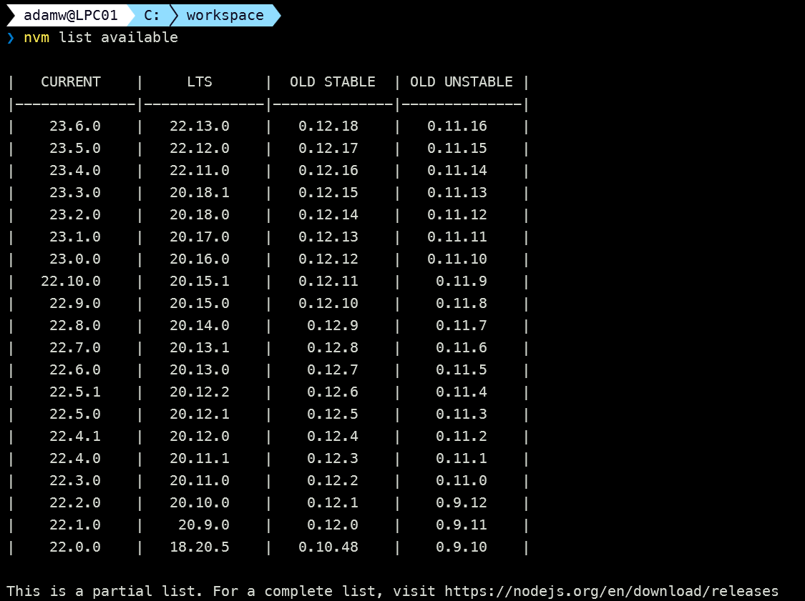
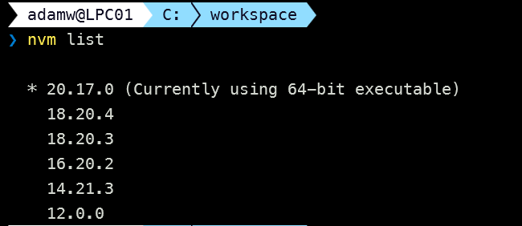
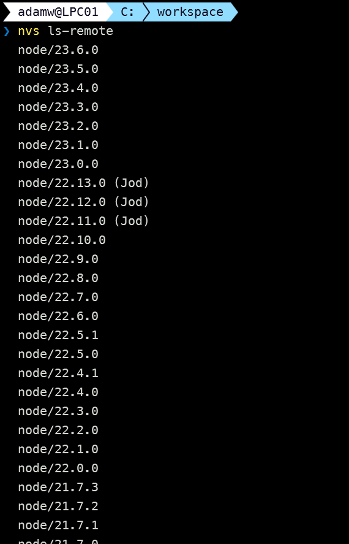
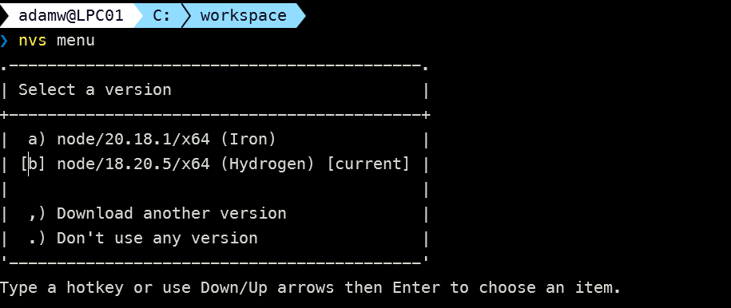
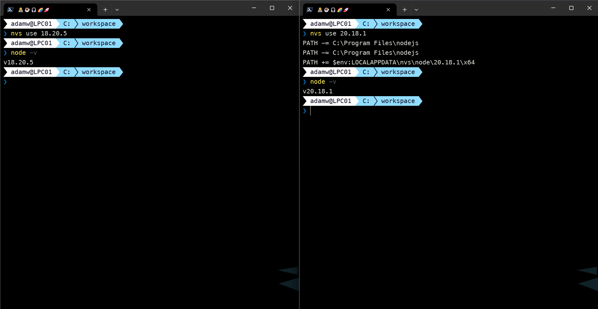
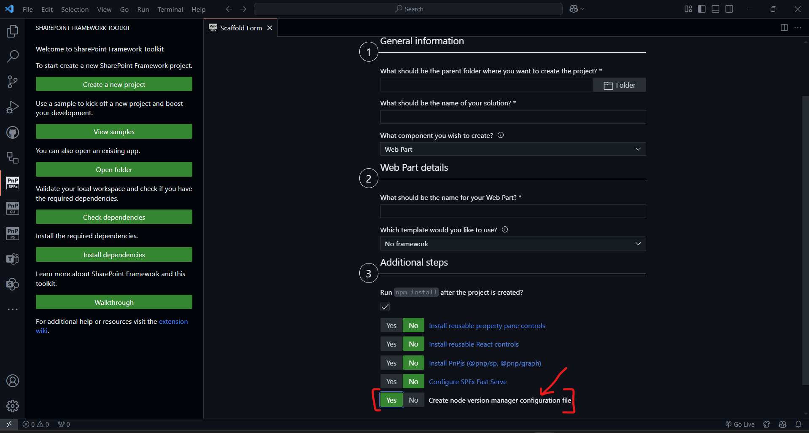
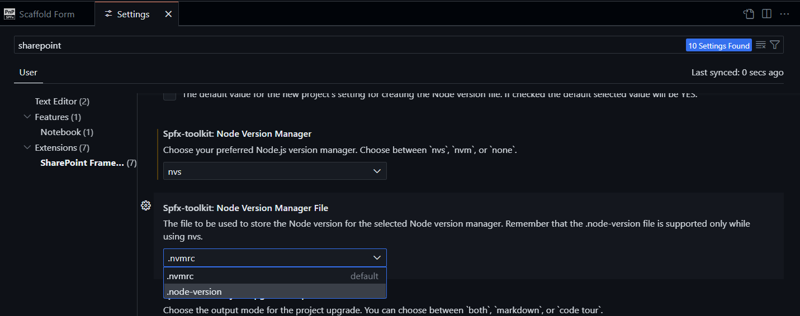

## Intro

When starting your journey with SharePoint Framework (SPFx) development, you always start with basic set up your development environment. In this post series I would like to introduce you to different ways to get ready for SPFx development. Over the next few posts, I will try to briefly explain how to:

- local setup using Node Version Manager (NVM) or Node Version Switcher (NVS) (which is this post)
- boost local setup using WSL
- use Docker for SPFx development
- code in the cloud using GitHub Codespaces

## Why do I need any node version manager?

Well if you just follow the guidance from [Microsoft Docs](https://learn.microsoft.com/en-us/sharepoint/dev/spfx/set-up-your-development-environment) you will end up with a single version of Node.js installed on your machine. This is not neccessarily a bad thing, especially if you just want to try out SPFx and create a few web parts. The problem starts when you need to manage multiple projects with different version of SPFx. This maybe from numerous resons. For example, you may still have solutions that target SharePoint 2019 which support projects created with version 1.4.1 of SPFx. Or you may just have some older projects which have little sense to upgrade to the latest version of SPFx. Or you are planning to try out one of the samples from the [PnP SPFx Samples gallery](https://pnp.github.io/sp-dev-fx-webparts/) which are not always up to date with the latest version of SPFx.
In such case you will need to manage multiple versions of Node.js on your machine as if we check the [SPFx development environment compatibility table](https://learn.microsoft.com/en-us/sharepoint/dev/spfx/compatibility#spfx-development-environment-compatibility) different versions of SharePoint Framework require different versions of Node.js. For example SPFx 1.4.1 which is the version that should be used for solutions that target SharePoint On-Prem, requires v6 or v8 of Node.js. On the other hand the latest version of SPFx which as of today is 1.20.0 requires Node.js v18. So in order to develop two projects on the same machine you will either need to uninstall and install the correct version of Node.js along with global dependecies every time or you may use a node version manager which allows you to install multiple versions of Node.js and switch between them with a single command.

## Node Version Manager (NVM)

From the couple of years of my work I noticed that NVM is one of most popular Node Version Managers widely used both on Mac OS and Windows. The setup and usage is very simple and straightforward. You may download the windows installer directly from GitHub repo releases - [NVM for Windows](https://github.com/coreybutler/nvm-windows/releases). Before installing nvm it's important to uninstall any version of Node.js you already have installed locally. After installing nvm the first thing you will want to do is to install the version(s) of Node.js you need. Let's see how to go about it.

To check the list of available versions of Node.js you may use the following command:

```sh
nvm list available
```

This will give you a partial list of possible versions of Node.js.



To install the version of Node.js you need you may use the following command:

```sh
nvm install <version>
```

Using the above you may install multiple versions of Node.js on your machine. To switch between them you may use the following command:

```sh
nvm use <version>
```


What's important to note is that nvm needs admin permissions to switch to a different version of Node. In most cases this will not be a problem but for some of you who work in a corporate environment where you don't have admin permissions on your machine this may be a blocker.

To check the version of Node.js you are currently using you may use the following command:

```sh
nvm current
```

And to check the list of installed versions of Node.js you may use the following command:

```sh
nvm list
```

This will an output similar to the one below:



The above are the basic commands you will need to manage multiple versions of Node.js on your machine. Thanks to that you may easily install and switch between different versions of Node.js and that way manage multiple SPFx projects with different versions of SPFx, also in each Node.js version you may have different global dependencies installed. 

Last thing which I guess is worth mentioning is the possiblity to set the default version of Node which should be used for a project. You may do that by creating a `.nvmrc` file in the root of your project and adding the version of Node.js you want to use in that project. After that when running `nvm use` command in the same location where `.nvmrc` file is located nvm will automatically switch to the version of Node.js specified in that file. This feature unfortunately is not available on nvm-windows.

## Node Version Switcher (NVS)

Although NVM is good enough in some cases you may want to use an alternative option especially if you don't have admin rights to your machine. In such case you may want to use Node Version Switcher (NVS). NVS is a cross-platform Node.js version manager that allows you to install multiple versions of Node.js and switch between them without the need for admin permissions. The setup and usage is very similar to NVM. You may download the windows installer directly from GitHub repo releases - [NVS for Windows](https://github.com/jasongin/nvs/releases), or you may also get it using `winget` by running the following command:

```sh
winget install jasongin.nvs
```

Similar to NVM you may check the list of available versions of Node.js using the following command:

```sh
nvs ls-remote
```



To install the version of Node.js you need you may use the following command:

```sh
nvs add <version>
```


Using the above you may install multiple versions of Node.js on your machine. To switch between them you may use the following command:

```sh
nvs use [version] 
```

And finally to list all nNode.js versions installed on your machine you may use the following command:

```sh
nvs ls
```

Also there is a nice little command that will run an interactive menu that will allow you to select the version of Node.js you want to use of if you want to add a new one. To run this command you may use the following:

```sh
nvs menu
```



What is worth mentioning is that when you switch to some Node version it is not done globally on your whole machine but it is done only for the current terminal session. This is very useful when you work on multiple projects that require different versions of Node.js. You may have different terminal windows open for different projects and in each of them you may use a different version of Node.js.



Last but not least, NVS `.nvmrc` files also on windows. That means you may add a `.nvmrc` file in the root of your project and specify the version of Node.js you want to use in that project. After that when running `nvs auto` command in the same location where `.nvmrc` file is located NVS will automatically switch to the version of Node.js specified in that file.
It also supports `.node-version` files, which similar to `.nvmrc` files specify the version of Node.js you want to use in that project.

## Summary

If you are starting your journey with SPFx development using local workspace, instead of VMs, dockers or CodeSpaces will be good enough for sure. But the first thing you will want to improve is the ability to run multiple versions of Node.js on your machine and switch between them. Both NVM and NVS will do the job for you. The choice between them is up to you. If you have admin permissions on your machine and you are looking for a simple and easy to use solution you may go with NVM. If you don't have admin permissions on your machine and you are looking for a solution that will allow you to switch between different versions of Node.js without the need for admin permissions you may go with NVS. The possiblity to run multiple versions of Node.js at same time which is provided by NVS may be a big advantage as well.

## SPFx Toolkit for Visual Studio Code

If you know me then you probably noticed VS Code extensions is my thing and before I wrap up this blog post there is one last thing worth mentioning. If you are using Visual Studio Code for your SPFx development you may want to install the [SharePoint Framework Toolkit](https://marketplace.visualstudio.com/items?itemName=m365pnp.viva-connections-toolkit) extension. This extension will help you get started with SPFx development helping you at every stage of the development process. Among many features it also has some that are specific to using node version managers. For example when you scaffold a new project using the create project form, in the additional steps part you may select to create a Node Version manager config file for you project with the current version of Node.js you are using.



In the extension settings you may specify if this will be a `.nvmrc` file or `.node-version` file. This is a very useful feature especially when you work on multiple projects and you want to make sure that you are using the correct version of Node.js in each of them.



Also in the extension settings you may specify which is your preferable Node Version Manager - NVM or NVS. Based on this setting the extension will execute the correct command to use the version of Node.js specified in the config file.

## Resources

- [Multiple Node.js Versions with Node Version Manager (NVM)](https://www.voitanos.io/blog/better-node-js-install-management-with-node-version-manager)
- [NVM for Windows](https://github.com/coreybutler/nvm-windows)
- [NVS](https://github.com/jasongin/nvs)
- [Setting up your SPFx Developer workstation without admin permissions](https://www.youtube.com/watch?v=JBCYoUNM3QY)
- [SharePoint Framework Toolkit](https://marketplace.visualstudio.com/items?itemName=m365pnp.viva-connections-toolkit)
- [Join the Microsoft 365 Developer Program]( https://developer.microsoft.com/en-us/microsoft-365/dev-program)
