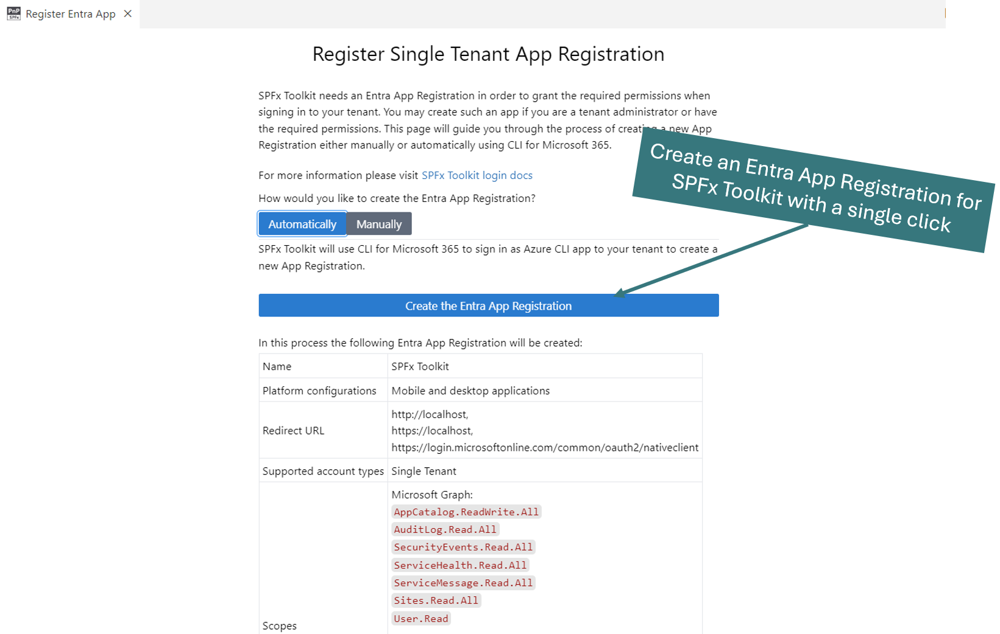
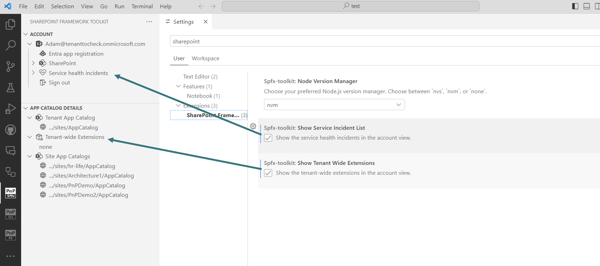
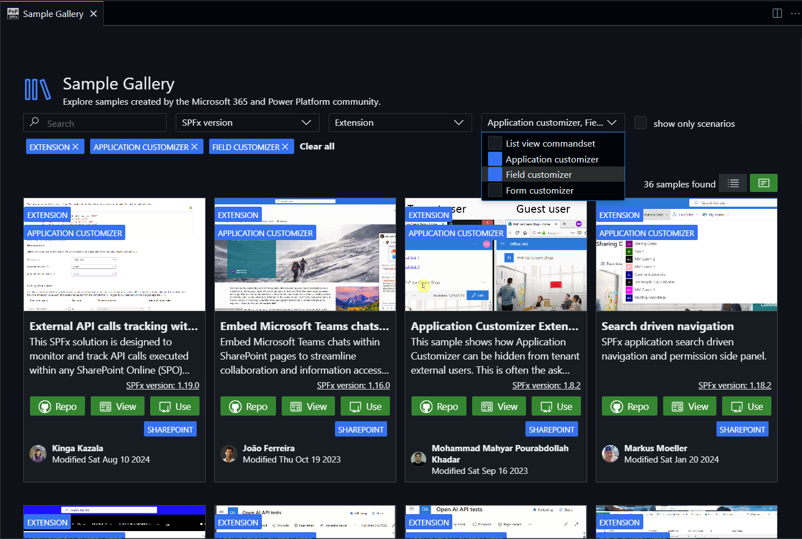
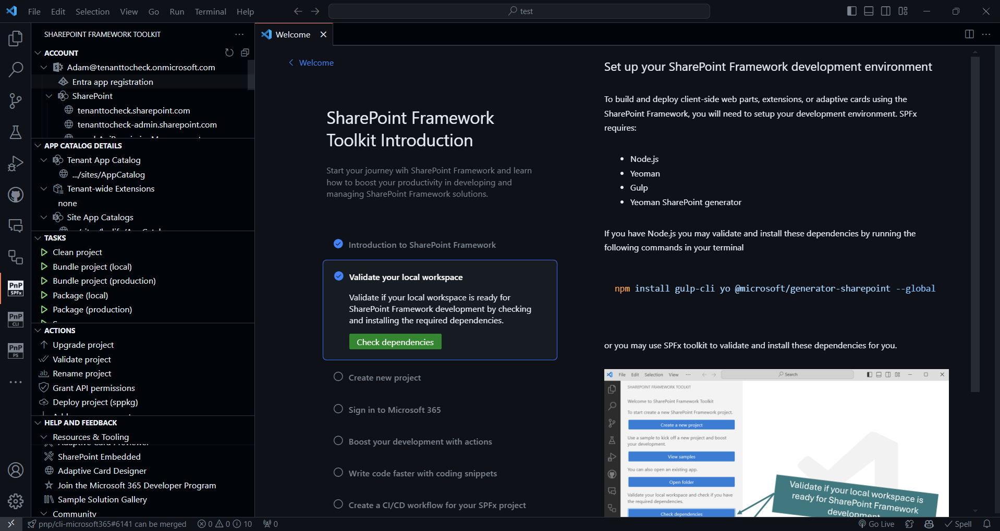

## 🗒️ Quick intro

[SharePoint Framework Toolkit](https://marketplace.visualstudio.com/items?itemName=m365pnp.viva-connections-toolkit) is a Visual Studio Code extension that aims to boost your productivity in developing and managing [SharePoint Framework solutions](https://learn.microsoft.com/sharepoint/dev/spfx/sharepoint-framework-overview?WT.mc_id=m365-15744-cxa) helping at every stage of your development flow, from setting up your development workspace to deploying a solution straight to your tenant without the need to leave VS Code, it even allows you to create a CI/CD pipeline to introduce automate deployment of your app 🚀 and now comes along with a dedicated @spfx Copilot Chat participant which is your AI assistant grounded for SharePoint Framework development.

Just check out the features list 👇 it's a looot 🤯.

Sounds cool 😎? Let's see some new enhancements we added in this major release

## Changes in sign-in to Microsoft 365 Tenant

In order for SPFx Toolkit to be able to perform actions on your tenant, like deploying your SPFx project, or granting the web API permissions, it needs some kind off Entra Application Registration that defines what scopes and permissions SPFx Toolkit will have to manipulate your tenant. Till now this VS Code extension, similarly like other PnP products, used the 'PnP Management Shell' multi-tenant app registration which was maintained and distributed from the PnP tenant. This was really convinient and fast way to get you up and running but unfortonatly this method will not be availalbe anymore after 9 of Semptber. You may read more details about this change in this [blog post](https://pnp.github.io/blog/post/changes-pnp-management-shell-registration/). 

Just to be clear, although it is a bit problematic this change is done for the best to encourage customers to improve their security posture by using their own single tenant app registrations with just the scopes and permissions which are needed. 

In this release we tried to make this transfer as easy as possible not only updating the default sign-in experience but also by providing you additional features that will allow you to setup your own Application Registration for SPFx Toolkit in matter of seconds 🤯. Let's go over the changes.

If you are already signed in to your tenant using the previous methos, after you upgrade SPFx Toolkit which usually it is done automatically by VS Code, then you will see a warning message explaining you the change and encouraging you to reauthenticate to your tenant ASAP.

After you click on the 'Sign in to Microsoft 365' button you will now see an additional prompt to either proceed with the rest of the authentication using your own existing Application Registration if you have one, or open up and additional page that will guide you over the process to create one

Most probably if you will be doing this for the very first time then you won't have such an Entra App Registration but don't worry, SPFx Toolkit will make this process super easy. After you select the option to create a new Application Registration you will be presented a brand new form giving you two ways to create one.

It is possible to do that either manually, and SPFx Toolkit will give you detailed step-by-step guidance to do that, or automatically, which is the default and recommended method. By selecting the automatic method SPFx Toolkit will use CLI for Microsoft 365 under the hood to sign in using Azure CLI Entra Application Registration to create a SPFx Toolkit Entra Application Registration with all of the needed permissions for you. After it completes this process it then retrieves the client Id and tenant Id of this new App Registration and performs regular sign using the newly created app. This may sound complex and magical 🪄 and belive me it is not. Actually from your point of view it's as easy as signing in twice. First to your Azure Tenant where the new Application Registration will be created and then to your Microsoft 365 tenant. Just check it out in action 👇

Of course it is still possible to just login using an exsiting Entra Application Registrration you already have on your tenant or you created one manually. In this case SPFx Toolkit will not prefil the Client and Tenant Id and you will need to fill them out on your own when performing the sign in. Let's see this flow in action 👇

Also please do remember we usually will need to do that one time as SPFx Toolkit keeps you authenticted so the next time you open up VS Code you will be already signed in to your Microsoft 365 tenant.

For more details on this change please check out the [SPFx Toolkit wiki](https://github.com/pnp/vscode-viva/wiki/5.3-Login-to-your-tenant-&-retrieve-environment-details).

## New SPFx Toolkit settings

SPFx Toolkit already provides a lot of features which may be overwhelming at start. Also some of those may just not be relevant to your work so in order to allow you to customize this product to your specific needs we extended the extensions with two new settings which allow you to show/hide the tenant health incidents list and tenat-wide extenstion list.

## Filter samples by SPFx extension type

SPFx Toolkit Sample Gallery provides 400+ projects that you may use as your own project. With a single click you may download a selected sample along with providing a new name to make a brand new solution that may be a huge kick start for your work. In this release we added an additional filter option to make it super easy to find the sample you are looking for. Till now you could filter by name, description, author, SPFx version and component type. Now we enchanced this functionality allowing you to filter by extension type. This filter option shows up only if you selected the 'Extension' component type in the previous filter.

## More guidance 

SPFx Toolkit not only about developing and managing your SPFx solutions but also it's about learing and helping you get started with SharePoint Framework in general. That is why this extension comes along with a dedicated step-by-step walkthrough that introduces you to SharePoint Framework from the very beginging, by providing you guidance on what SPFx is, how to setup a new tenant and your local workspace for SPFx development and how you may leverage SPFx Toolkit to boost your work to the next level. In this release we improved the initial steps of this walkthrough by providing more information and guidance that introduces you to SharePoint Framework and what dependencies you need to start SPFx development.

## 👏 You ROCK 🤩

This release would not have been possible without the help of some really awesome folks who stepped in and joined our journey in creating the best in class SharePoint Framework tooling in the world. We would like to express our huge gratitude and shout out to:

- [Guido Zambarda](https://github.com/GuidoZam)
- [Nico De Cleyre](https://github.com/nicodecleyre)
- [Saurabh Tripathi](https://github.com/Saurabh7019)
- [Luccas Castro](https://github.com/DevPio)

## 🗺️ Future roadmap

We don't plan to stop, we are already thinking of more awesome features we plan to deliver with v5 release. If you want to check what we are planning check out our [issues from this milestone](https://github.com/pnp/vscode-viva/milestone/6). Feedback is appreciated 👍.

## 👍 Power of the community

This extension would not have been possible if it weren’t for the awesome work done by the [Microsoft 365 & Power Platform Community](https://pnp.github.io/). Each sample gallery: SPFx web parts & extensions, and ACE samples & scenarios are all populated with the contributions done by the community. Many of the functionalities of the extension like upgrading, validating, and deploying your SPFx project, would not have been possible if it wasn’t for the [CLI for Microsoft 365](https://pnp.github.io/cli-microsoft365/) tool. I would like to sincerely thank all of our awesome contributors! Creating this extension would not have been possible if it weren’t for the enormous work done by the community. You all rock 🤩.

If you would like to participate, the community welcomes everybody who wants to build and share feedback around Microsoft 365 & Power Platform. Join one of our [community calls](https://pnp.github.io/#community) to get started and be sure to visit 👉 https://aka.ms/community/home.

## 🙋 Wanna help out?

Of course, we are open to contributions. If you would like to participate do not hesitate to visit our [GitHub repo](https://github.com/pnp/vscode-viva) and start a discussion or engage in one of the many issues we have. We have many issues that are just ready to be taken. Please follow our [contribution guidelines](https://github.com/pnp/vscode-viva/blob/main/contributing.md) before you start.
Feedback (positive or negative) is also more than welcome.

## 🔗 Resources

- [Download SharePoint Framework Toolkit at VS Code Marketplace](https://marketplace.visualstudio.com/items?itemName=m365pnp.viva-connections-toolkit)
- [SPFx Toolkit GitHub repo](https://github.com/pnp/vscode-viva)
- [Microsoft 365 & Power Platform Community](https://pnp.github.io/#home)
- [Join the Microsoft 365 & Power Platform Community Discord Server]( https://aka.ms/community/discord)
- [Wiki]( https://github.com/pnp/vscode-viva/wiki)
- [Join the Microsoft 365 Developer Program]( https://developer.microsoft.com/en-us/microsoft-365/dev-program)
- [CLI for Microsoft 365](https://pnp.github.io/cli-microsoft365/)
- [Sample Solution Gallery]( https://adoption.microsoft.com/en-us/sample-solution-gallery/)
