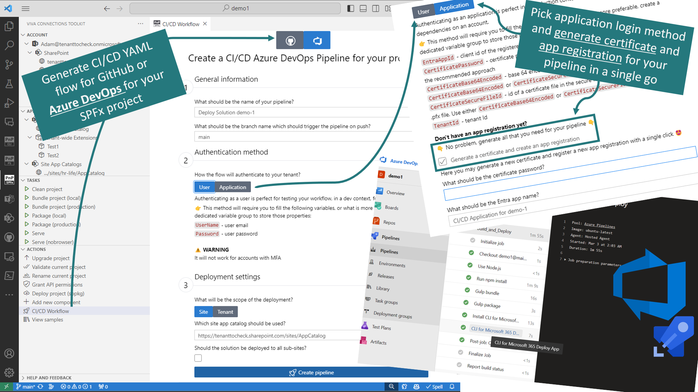
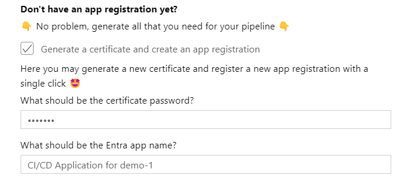
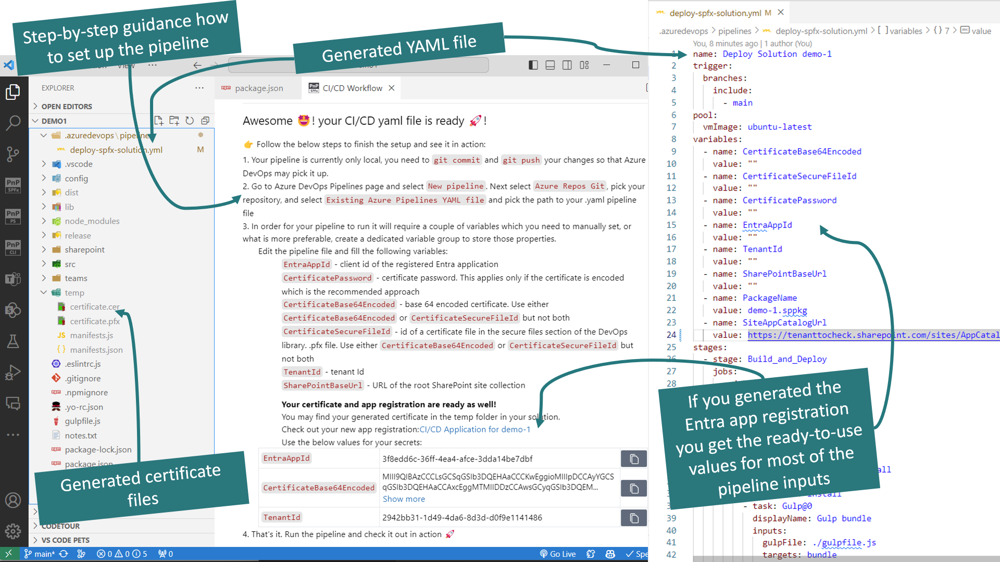
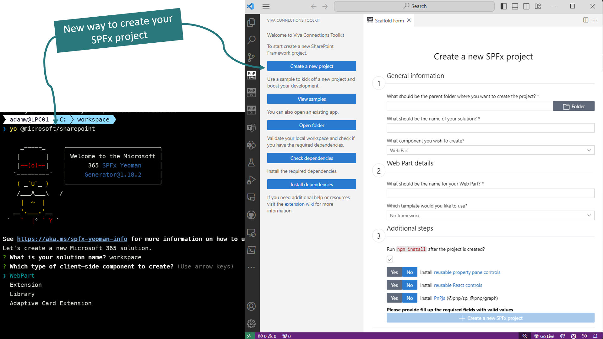
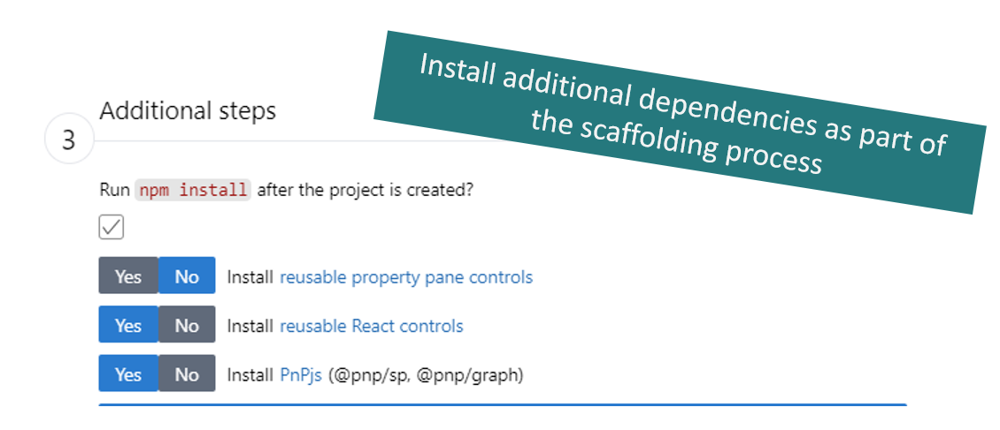
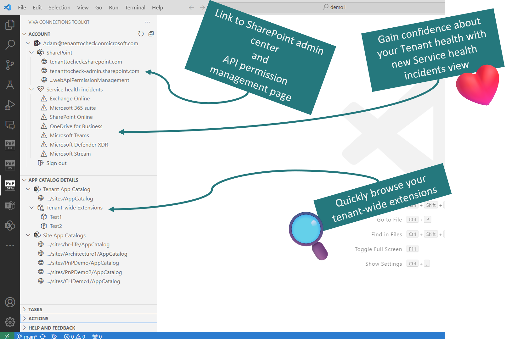

## 🗒️ Quick intro

[Viva Connections Toolkit (SPFx Toolkit)](https://marketplace.visualstudio.com/items?itemName=m365pnp.viva-connections-toolkit) is a Visual Studio Code extension that aims to boost your productivity in developing and managing [SharePoint Framework solutions](https://learn.microsoft.com/sharepoint/dev/spfx/sharepoint-framework-overview?WT.mc_id=m365-15744-cxa) helping at every stage of your development flow, from setting up your development workspace to deploying a solution straight to your tenant without the need to leave VS Code, it even allows you to create a CI/CD pipeline to introduce automate deployment of your app 🚀.

All of that is possible due to the awesome work done by the [PnP community](https://pnp.github.io/) which is visible in many functionalities of this extension: sample gallery filled with [PnP samples](https://pnp.github.io/#samples), upgrading SPFx project using [CLI for Microsoft 365](https://pnp.github.io/cli-microsoft365/), and many more. It does not matter if you are starting your journey with SPFx development and Viva solutions or if you are already experienced in this area, this VS Code extension will have the features you need to kick off your work to the next level 💪.

In this minor release, the team focused on rebuilding the SPFx project scaffolding process from the ground up and introduced a dedicated form for that with additional capabilities that the default yeoman generator does not have. Also in this release, the team worked extensively on bringing the support for Azure DevOps to generate a CI/CD pipeline for your SPFx project.

Check out the full list of updates in this release 👇:

- 👉 Refactored and rebuilt the scaffolding process
- 👉 Added an additional dependency step in the scaffolding form
- 👉 Added Azure DevOps pipeline support
- 👉 Updated account tree view with additional links to SharePoint admin site, web API permission management page and health incident list
- 👉 Updated app catalog tree view adding tenant-wide extensions list

Sounds cool 😎? Let’s have a deeper dive and check a couple of updates in a bit more detail 👇

## 🚀 Generate and Azure DevOps pipeline along with generating a certificate and Entra app registration for your login flow

One of the most awaited features is finally here! The support to generate an Azure DevOps YAML pipeline file in a matter of a single click, and we mean it as by default the pipeline scaffolding form is prefilled with defaults based on your SPFx project so you may generate a pipeline that will use application login method and will deploy your SPFx package to the tenant app catalog without changing any of the values in the form 🤯.

It's also worth pointing out that it was developed the same way as the GitHub workflow so the team first contributed this as a new command in [CLI for Microsoft 365](https://pnp.github.io/cli-microsoft365/cmd/spfx/project/project-azuredevops-pipeline-add) so you may use the same functionality to automate your work in any kind of way. As Viva Connections Toolkit under the hood uses CLI for Microsoft 365 as its dependency we also use the same command to scaffold the YAML file but as a benefit, we give you a readable and easy-to-use UI on that and, what's even more awesome, we allow you to generate a new certificate along with a new Entra app registration that will be needed for your pipeline in case you will be using the application login method. This is a huge boost! 💪

In the end, what you will get is the YAML definition of your Azure DevOps pipeline. This is important to understand, it will not set up the flow for you as Viva Connection Toolkit does not integrate with Azure DevOps nor GitHub, so in the end you always have a few manual steps to go over to set up the flow. But what's also good to know is that when you generate the flow you get detailed step-by-step guidance on how to set it up the first time in Azure DevOps. What's even more awesome is if you selected to generate the Entra app registration in the pipeline output you will get a new app with a link to it and a table with most of the variables that are required for your flow like Entra App Id, or Tenant Id or the encoded string of your certificate. You may also use the certificate file itself if you want, and what is maybe more preferable, as the generated certificate is located in the `temp` folder. 

If needed go over the [docs for more guidance](https://github.com/pnp/vscode-viva/wiki/5.5-Actions#azure-devops) regarding this functionality and check it out in action 👇

We don't plan to stop here 😍. We would love to hear your feedback 🙏 and in the future releases we are already investigating more ways how this experience could be improved and to provide support for GitLab 🤯

## 🆕 New and better way to scaffold your SPFx project

One of the feedback we got regarding things that might be improved in the SPFx toolchain was the project scaffolding. Till now each developer needs to use Yeoman Microsoft SharePoint generator for that and under the hood this is the same thing Viva Connections Toolkit uses. We heard your comments about rebuilding this experience from the ground up giving you a clear UI that validates all your inputs while you type and gives you clarity on what information is required to create any kind of component type.

But it's not only the UI. We also introduced a new, optional, step in the scaffolding process that allows you to select additional popular dependencies that will be installed to your project together with the scaffolding. Currently we support installing [PnP reusable property pane controls](https://pnp.github.io/sp-dev-fx-property-controls/), [PnP reusable React controls](https://pnp.github.io/sp-dev-fx-controls-react/), and [PnPjs](https://pnp.github.io/pnpjs/). As of now we only install the dependencies and do not provide any additional setup but this is just the first step and in future releases we plan to improve this functionality 👍.

Check it out in action 👇

We don't plan to stop here 😍. We would love to hear your feedback 🙏 and in future releases, we are already checking for more ways to improve the scaffolding process like adding fast-serve integration, or more scaffolding templates that for example will use react hooks by default.

## 👀 More tenant management features

Viva Connections toolkit is not only about developing but also managing your SPFx solutions. In this release we revisited our account and environment tree views. 

In the first one, we provide you with more navigation links that might be helpful for your work like links to SharePoint admin portal or to the web API permission management page. We also added a new section that will show you all service health incidents that are currently happening on your tenant. Clicking on the link will redirect you to the health incident report. This should give you more insights about what's going on with your tenant and may give you a quick answer why some of the features you are using might not be working properly

The environment view was renamed to 'app catalog details' and in this release, we added an additional feature to give you more power around managing your SPFx solutions. We added a list that shows you tenant-wide extensions installed on your tenant. This is just a first step in more management features but it will already give you a quick overview of all of the solutions that are impacting your SharePoint online pages, or lists, or forms.

We don't plan to stop here 😍. We would love to hear your feedback 🙏 and in future releases, we are already thinking on more ways that will allow you to manage deployed SPFx packages to your app catalogs.

## 🗺️ Future roadmap

This release is our last step before the next v3 release of this extension. Check out the [issue list for v3 release](https://github.com/pnp/vscode-viva/issues?q=is%3Aopen+is%3Aissue+milestone%3Av3.0) to find out more. And we don't plan to stop, we are already thinking of v4 and new ways to extend features that were introduced in this release. If you want to check what we are planning or add your own idea please [join the discussion](https://github.com/pnp/vscode-viva/discussions/159). Feedback appreciated 👍.

## 👍 Power of the community

This extension would not have been possible if it weren’t for the awesome work done by the [Microsoft 365 & Power Platform Community](https://pnp.github.io/). Each sample gallery: SPFx web parts & extensions, and ACE samples & scenarios are all populated with the contributions done by the community. Many of the functionalities of the extension like upgrading, validating, and deploying your SPFx project, would not have been possible if it wasn’t for the [CLI for Microsoft 365](https://pnp.github.io/cli-microsoft365/) tool. I would like to sincerely thank all of our awesome contributors! Creating this extension would not have been possible if it weren’t for the enormous work done by the community. You all rock 🤩.

If you would like to participate, the community welcomes everybody who wants to build and share feedback around Microsoft 365 & Power Platform. Join one of our [community calls](https://pnp.github.io/#community) to get started and be sure to visit 👉 https://aka.ms/community/home.

## 🙋 Wanna help out?

Of course, we are open to contributions. If you would like to participate do not hesitate to visit our [GitHub repo](https://github.com/pnp/vscode-viva) and start a discussion or engage in one of the many issues we have. Feedback (positive or negative) is also more than welcome.

## 🔗 Resources

- [Download Viva Connections Toolkit at VS Code Marketplace](https://marketplace.visualstudio.com/items?itemName=m365pnp.viva-connections-toolkit)
- [Viva Connections Toolkit GitHub repo](https://github.com/pnp/vscode-viva)
- [Microsoft 365 & Power Platform Community](https://pnp.github.io/#home)
- [Join the Microsoft 365 & Power Platform Community Discord Server]( https://aka.ms/community/discord)
- [Wiki]( https://github.com/pnp/vscode-viva/wiki)
- [Join the Microsoft 365 Developer Program]( https://developer.microsoft.com/en-us/microsoft-365/dev-program)
- [CLI for Microsoft 365](https://pnp.github.io/cli-microsoft365/)
- [Sample Solution Gallery]( https://adoption.microsoft.com/en-us/sample-solution-gallery/)
